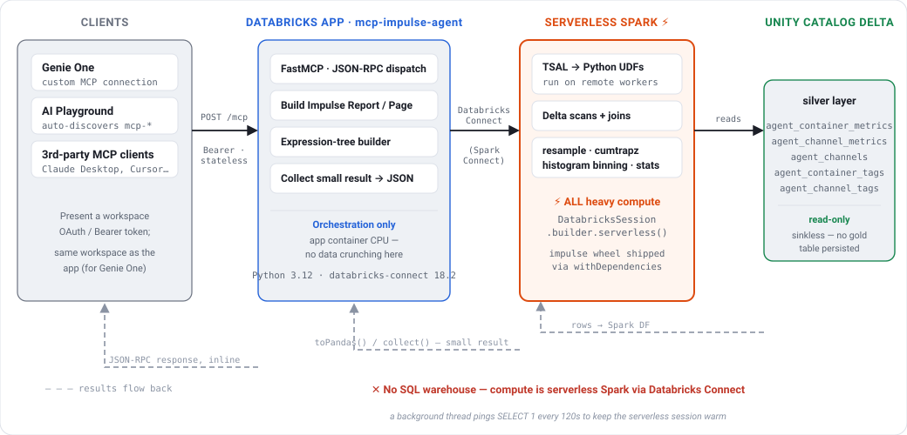
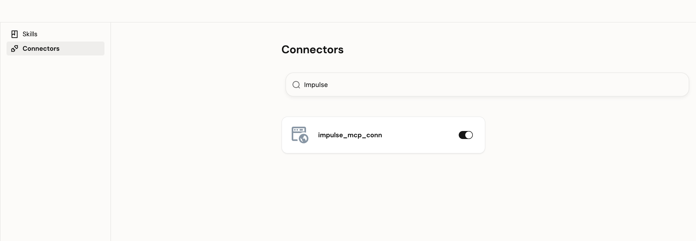
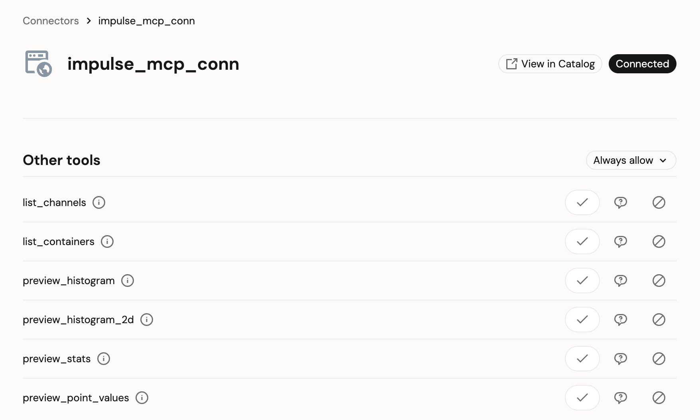
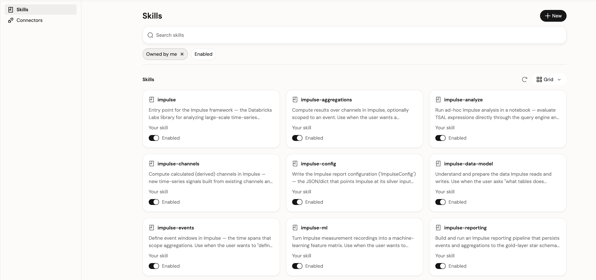
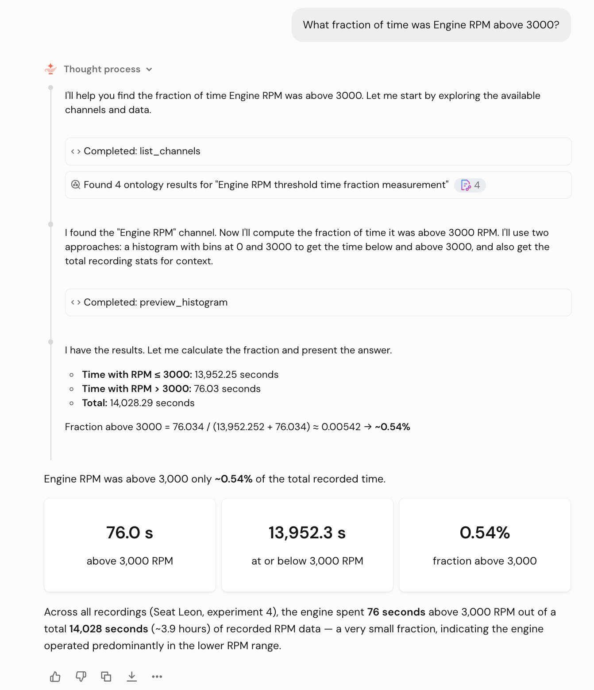
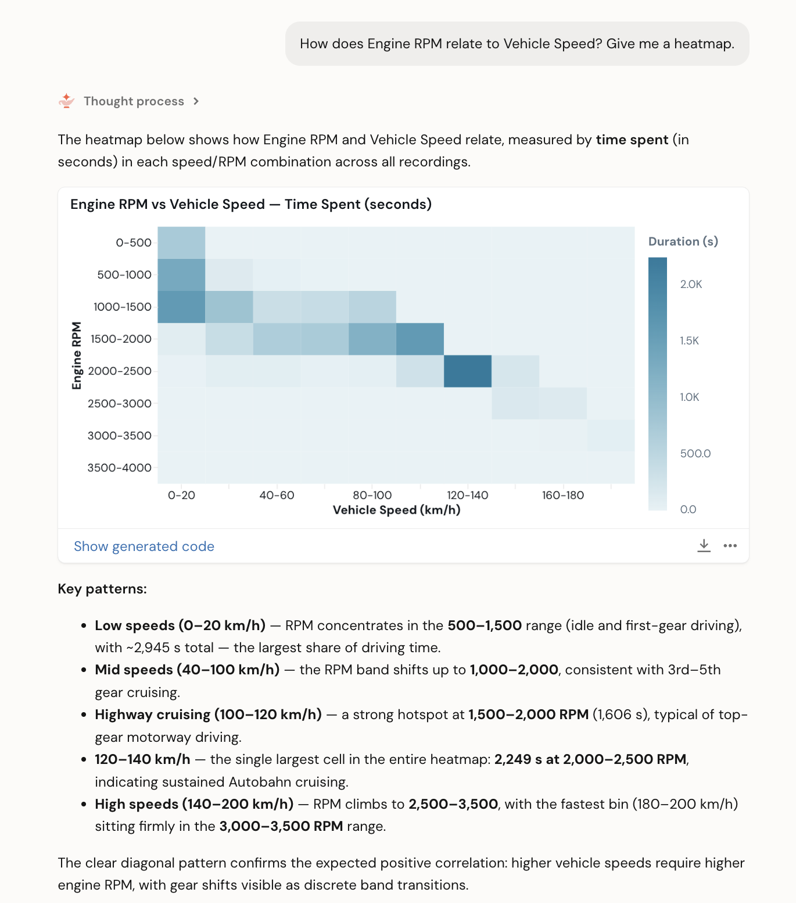
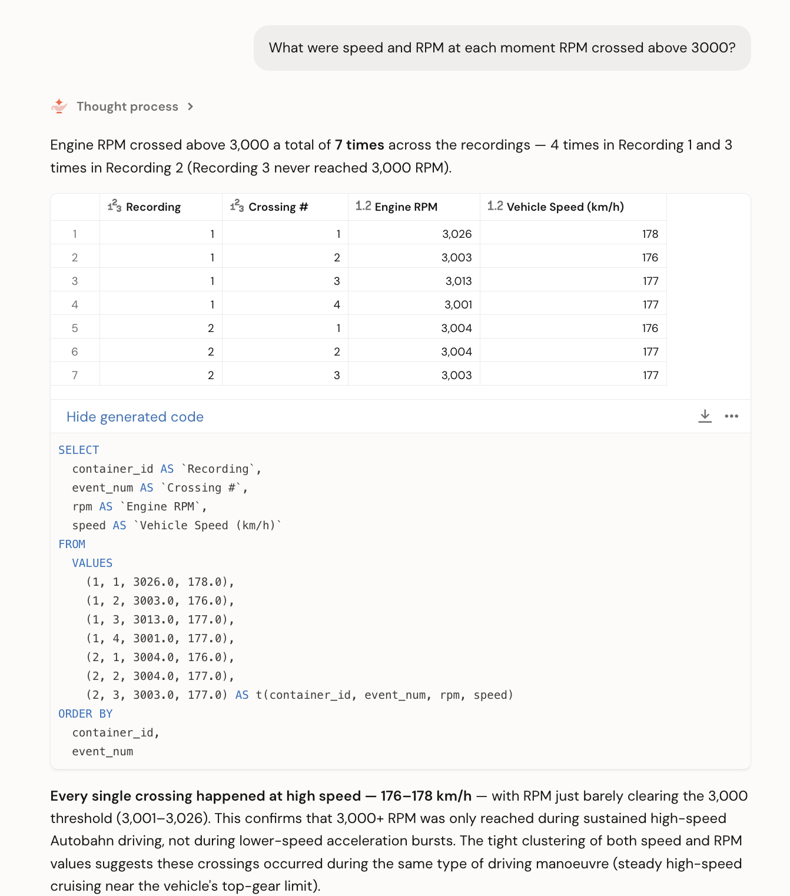

# Ad-hoc agent queries via MCP

This guide covers the `demos/agent_mcp_query.ipynb` notebook and the deployable MCP server in
`demos/agent_mcp_app/`. Together they let a conversational agent — **Genie One** (via its MCP
support), AI Playground, or any [MCP](https://modelcontextprotocol.io) client — answer *ad-hoc*
questions about measurement data ("what fraction of time was the engine above 3000 RPM?", "how
does RPM relate to speed?") by building and running a TSAL report on the fly and returning the
answer inline, with **no gold-layer table defined up front**.

This is the complement to the [Reporting walkthrough](./demo.md): reporting persists a fixed
star schema for known questions; this pattern computes one-off answers for questions you didn't
know in advance.

## What is Genie One?

[Databricks Genie One](https://docs.databricks.com/aws/en/genie-one/) is the current Databricks
conversational analytics experience: users ask questions in natural language and Genie One answers
over governed data. Beyond text-to-SQL, Genie One can call **external tools** exposed over the
Model Context Protocol (MCP), with every tool call governed through Unity Catalog. That is the hook
this demo uses — instead of teaching Genie One to write Impulse Python, we give it a small set of
MCP **tools** it can call, and Unity Catalog controls who may use them.

The result: a Databricks user asks an Impulse question in plain language, Genie One picks the right
tool, fills in the parameters, runs it, and reads back the numbers — no notebook, no bespoke
frontend.

## Why not point Genie One straight at the gold layer?

Genie One does text-to-SQL against tables that already exist. Impulse's value is defining a *new*
TSAL event/aggregation per question — there is no way to pre-populate gold tables for arbitrary
thresholds, bin edges, and virtual signals. So instead of exposing tables, this demo exposes a
small set of **tools** that construct and run Impulse reports on demand.

## The six tools

Two for discovery, four for computation:

| Tool | Answers |
|------|---------|
| `list_channels` | What channels exist, and their tag vocabulary (brand, model, unit, …) |
| `list_containers` | What recordings exist, and their tags (vehicle, route, condition, …) |
| `preview_histogram` | 1D duration-weighted distribution of a signal or virtual signal |
| `preview_histogram_2d` | 2D heatmap of two signals |
| `preview_stats` | min / max / mean / median across one or more signals |
| `preview_point_values` | signal values sampled at discrete instants (e.g. each threshold crossing) |

The compute tools accept a constrained **expression tree** for virtual signals (whitelisted ops
and methods — no free-form code) and an **event** spec that scopes the computation to a time
window or a set of instants. See the tool descriptions themselves for the full grammar.

## Architecture and execution model

The important thing to understand before deploying: **the MCP server does almost no computation
itself.** It is a thin FastMCP process that builds an Impulse `Report` and delegates the actual
work to **serverless Spark** over Databricks Connect. There is **no SQL warehouse** anywhere in
the path.



Where each unit of work runs:

| Operation | Runs on |
|-----------|---------|
| MCP protocol, JSON-RPC, tool dispatch | **App** (Databricks Apps container) |
| Build `Report` / `Page` / expression trees / events | **App** — pure Python object graph |
| Read silver tables (`list_channels`/`list_containers`) | **Serverless Spark** |
| TSAL evaluation: `resample`, `cumtrapz`, edge detection, histogram binning, stats | **Serverless Spark** — compiled to Python UDFs on remote workers |
| Table storage & scan | **Unity Catalog Delta** — silver `agent_*` tables |
| Final `.toPandas()` / `.collect()` of the result | Serverless computes it, the small result returns to the app |
| SQL warehouse | **not used** |

Two design points make this work interactively:

- **Sinkless.** The tools read `report.aggregation_dfs[...]` directly (already in final fact
  schema) instead of persisting a gold table and reading it back. Persisting measured 33–43s per
  call — over AI Playground's ~55s timeout — while the sinkless path plus skipping the extra
  Unity Catalog round trips brings warm calls to ~2–11s. Cold start of the serverless session is
  ~50s on the first compute call.
- **The Impulse wheel is shipped to the workers.** Because TSAL runs as Python UDFs on the
  serverless workers, `get_spark()` attaches the Impulse wheel via
  `DatabricksEnv().withDependencies("local:<wheel>")`, so the app process and the workers run
  byte-identical code.

:::note Stateless transport
The server is created with `FastMCP(..., stateless_http=True)` and served over
`streamable-http` at `/mcp`. Statelessness is required for Genie One's MCP client (each tool call
is self-contained, no session id is negotiated), and AI Playground discovery still works unchanged.
:::

## Step 1 — Run the notebook

`demos/agent_mcp_query.ipynb` loads a self-contained silver layer from the demo CSVs, defines
the tools, and exercises them through an in-process MCP client — so you can see the tool
schemas and results before deploying anything. Set the **Catalog**, **Schema**, and **Table
Prefix** widgets and run top to bottom.

:::note Serverless environment version
Impulse needs Python 3.11+. On Databricks Serverless, use **Environment Version 2 or higher** —
Version 1 ships Python 3.10 and the first Impulse import fails. (The data-load cells work on any
version.)
:::

## Step 2 — Deploy the MCP server as a Databricks App

`demos/agent_mcp_app/` packages the same tools as a FastMCP server that runs on a Databricks
App with a warm serverless Spark session. In short:

```bash
cd demos/agent_mcp_app
./build_wheel.sh                        # build the Impulse wheel the app installs + ships to workers
# set CATALOG / SCHEMA / TABLE_PREFIX in app.yaml
databricks apps create mcp-impulse-agent          # name must start with mcp-
databricks sync . /Workspace/Users/<you>/mcp-impulse-agent --full --include 'wheels/*.whl'
databricks apps deploy mcp-impulse-agent --source-code-path /Workspace/Users/<you>/mcp-impulse-agent
```

Then grant the app's service principal read access (plus scratch-write) on your schema. Full
commands, the service-principal grant, and latency notes are in the app's
[`README.md`](https://github.com/databrickslabs/impulse/blob/main/demos/agent_mcp_app/README.md).

Note the app's URL from `databricks apps get mcp-impulse-agent` — it looks like
`https://mcp-impulse-agent-<id>.<region>.databricksapps.com`. The MCP endpoint is that URL plus
`/mcp`.

## Step 3 — Connect it to Genie One

There are two ways to make the server available to Genie One. The **Unity Catalog connection** path
is the governed one and is recommended: the server becomes a first-class Unity Catalog securable,
and every tool call is governed and observable through Unity Gateway.

### 3a. Register the app as a Unity Catalog MCP connection

An MCP server hosted on a Databricks App is registered as an **`HTTP` connection** with the
`is_mcp_connection` option set to `true`, pointing at the app's `/mcp` endpoint and authenticating
to the app with workspace OAuth. Two credential modes work: **M2M** (a dedicated service
principal — fully scriptable, best for shared use) or **U2M** (per-user OAuth consent). The M2M
flow is shown here.

**1. Dedicate a service principal.** Create an SP for the connection (e.g. `impulse-mcp-sp`) so
its access is scoped and auditable on its own, rather than reusing a personal or the app's
identity. Use **Settings → Identity and access → Service principals → Add service principal**, or
the CLI:

```bash
databricks service-principals create --display-name impulse-mcp-sp
```

Note its **client ID** (the `application_id`) — you'll use it as `client_id` below.

**2. Generate an OAuth secret for it.** M2M authenticates with a client-credentials secret. On the
service principal's page, go to **Secrets → Generate secret** and copy the secret — it is shown
only once. (Account-admin CLI equivalent: `databricks service-principal-secrets create <sp-id>`.)
The client ID plus this secret are the connection's credentials.

**3. Let the SP call the app.** The connection authenticates to the app *as this SP*, so grant it
`CAN_USE` on the app — without this, tool calls fail with `401`. It does **not** need Unity Catalog
access to the silver tables — the app reads those as its own service principal.

```bash
databricks apps update-permissions mcp-impulse-agent --json '{
  "access_control_list": [
    {"service_principal_name": "<sp-client-id>", "permission_level": "CAN_USE"}
  ]
}'
```

**4. Create the connection.** `base_path` is the app URL's `/mcp` suffix and `token_endpoint` is
your workspace's OIDC token endpoint:

```bash
databricks connections create --json '{
  "name": "impulse_mcp_conn",
  "connection_type": "HTTP",
  "options": {
    "host": "https://mcp-impulse-agent-<id>.<region>.databricksapps.com",
    "port": "443",
    "base_path": "/mcp",
    "is_mcp_connection": "true",
    "oauth_scope": "all-apis",
    "token_endpoint": "https://<workspace-host>/oidc/v1/token",
    "client_id": "<sp-client-id>",
    "client_secret": "<sp-oauth-secret>"
  }
}'
```

:::caution Keep it metastore-level for Genie One
Create the connection at the **metastore level** (as above — no schema parent). Genie One's
connection picker currently surfaces only metastore-level MCP connections; a schema-level
connection created under a `catalog.schema` (the CLI `--parent` option) generally will **not**
appear in Genie One, though it can still be used from AI Gateway, AI Playground, and agent
workflows.
:::

:::tip U2M or the UI instead
For a **U2M** (per-user) connection, drop `client_secret`, add
`"authorization_endpoint": "https://<workspace-host>/oidc/v1/authorize"`, and complete the browser
consent on first use. You can also create either kind interactively in **Catalog Explorer →
External Data → Connections → Create connection** (type **HTTP**, enable the MCP option), which
runs the OAuth handshake for you.
:::

**5. Verify and share it:**

```bash
databricks connections get impulse_mcp_conn      # expect connection_type HTTP, options.is_mcp_connection true
```

```sql
GRANT USE CONNECTION ON CONNECTION impulse_mcp_conn TO `<group-or-user>`;
```

:::note Governance vs. data access
The connection governs **who may reach the MCP server**. The tools themselves still read the
silver layer as the *app's* service principal (see [Limitations](#limitations)), so grant the app
SP the Unity Catalog read access described in the app README as well.
:::

### 3b. Add it in Genie One

Once the connection exists and shows `is_mcp_connection: true`, add it to a Genie One session:

1. Open **Genie One** and click the **+** at the bottom-left of the search bar.
2. Choose **More connections**.
3. Select your MCP connection (`impulse_mcp_conn`).



With M2M OAuth there's no user login step. Anyone who selects the connection needs `USE CONNECTION`
on it (granted in 3a).

Opening the connection shows its six tools, each of which you can allow, ask per call, or deny:



:::caution If the MCP option is missing
The custom-MCP connection only appears when the workspace preview **Third Party Connectors for
Agents** is enabled (**Settings → Previews**). That same preview gates the MCP toggle on the
Catalog Explorer **HTTP** connection form — which is why creating the connection from the CLI
(with `is_mcp_connection: "true"` in `options`, as above) is the reliable route: it sets the flag
regardless of the preview. A plain HTTP connection created without that flag will not surface in
Genie One.
:::

**Genie Code alternative (no UC connection).** In a Genie Code session you can skip the connection
entirely: **Settings → MCP Servers → Add Server → Custom MCP servers**, select the
`mcp-impulse-agent` app, and **Save**. Simpler, but ungoverned — the UC connection path is
preferred for anything shared or production-facing.

### 3c. Add the Impulse skills

The MCP connection gives Genie One the *tools*; the **skills** give it the *domain knowledge* to
use them well. Genie One **Skills** are governed `SKILL.md` instruction files — they don't execute
anything, they teach the model Impulse's vocabulary and concepts (TSAL, channels, events, the data
model) so it picks the right tool, composes valid expressions, and interprets results correctly.
Each skill's `description` is a "use when…" trigger, so Genie One loads only the relevant ones per
question.

Import them from the repo's [`skills/`](https://github.com/databrickslabs/impulse/tree/main/skills):

```bash
databricks workspace import-dir skills /Workspace/Users/<you>/.assistant/skills
```

They then appear under **Genie One → Skills**, each individually toggleable:



The ten skills:

| Skill | What it teaches Genie One |
|-------|---------------------------|
| `impulse` | entry point — what Impulse is, and which skill to reach for |
| `impulse-tsal` | the TSAL language — selecting channels, deriving signals, edges, resampling, integration |
| `impulse-channels` | calculated (derived) channels materialized at per-sample grain |
| `impulse-events` | event windows that scope aggregations (basic, container, sequence, points-in-time) |
| `impulse-aggregations` | histograms, 2D heatmaps, statistics, and point-value sampling |
| `impulse-data-model` | the silver tables Impulse reads and the gold star schema it writes |
| `impulse-config` | the report configuration (`ImpulseConfig`) — sources, sink, solver |
| `impulse-reporting` | building a persisted gold-layer reporting pipeline |
| `impulse-analyze` | ad-hoc notebook analysis straight through the query engine |
| `impulse-ml` | turning recordings into an ML feature matrix |

Most cover Impulse's Python API broadly; combined with the MCP connection, Genie One applies that
knowledge to drive the tools. The demo also ships a bridge skill
([`genie_skill/impulse-mcp`](https://github.com/databrickslabs/impulse/blob/main/demos/agent_mcp_app/genie_skill/impulse-mcp/SKILL.md))
that tells Genie One to prefer the MCP tools over hand-writing Impulse Python for ad-hoc questions.

### 3d. Call it in natural language

With the tools connected and the skills installed, just ask. Genie One grounds itself with
`list_channels`, picks the right compute tool, fills in the bins / event / signal, and returns
the numbers inline:

> *"What measurement channels and vehicles do we have?"* → `list_channels` / `list_containers`
>
> *"What fraction of time was Engine RPM above 3000?"* → `preview_histogram`, then sums the top bins ÷ total
>
> *"Average and max RPM while vehicle speed was above 100 km/h?"* → `preview_stats` with a basic event
>
> *"How does Engine RPM relate to Vehicle Speed? Give me a heatmap."* → `preview_histogram_2d`
>
> *"What were speed and RPM at each moment RPM crossed above 3000?"* → `preview_point_values` with a points-in-time event

Here are three of those questions run against the live server, each showing a different side of
Genie One:

**Reasoning you can see.** Genie One plans the answer, calls `list_channels` then
`preview_histogram`, and shows every step before giving the result:



**Charts, not just numbers.** A `preview_histogram_2d` call comes back as a rendered heatmap, with
the generated code one click away and the patterns explained:



**The code is right there.** For a `preview_point_values` question, Genie One returns a table of
every threshold crossing alongside the exact query it ran:



Custom MCP tools don't always trigger automatically. If Genie One answers from something else, name
the connection and tool explicitly — e.g. *"Use `impulse_mcp_conn` and call `list_channels`."*

A complete, reproducible end-to-end runbook — deployment specifics, the wiring, and verified
tool-call results captured against a live server — lives alongside the app at
[`demos/agent_mcp_app/GENIE_ONE.md`](https://github.com/databrickslabs/impulse/blob/main/demos/agent_mcp_app/GENIE_ONE.md).

## Requirements

- Unity Catalog and serverless compute.
- An already-loaded Impulse silver layer (the notebook loads the demo one for you).
- For Genie One: the app deployed in the **same workspace**, reachable at `/mcp` in stateless mode
  (both handled by this demo).

## Limitations {#limitations}

- **Single shared identity.** Every caller executes under the app's one service principal and its
  Unity Catalog grants — there is no on-behalf-of-user authorization yet. A UC connection governs
  who can reach the server, but the data reads still run as the app SP.
- **Duration weighting only.** Distance/custom-weighted histograms are intentionally disabled (a
  known upstream numerical issue); the tools raise a clear error rather than return wrong numbers.
- **Serverless Environment Version.** The notebook needs Environment Version 2+ (Python 3.11+);
  the app is unaffected (it pins Python 3.12 in its own venv).
